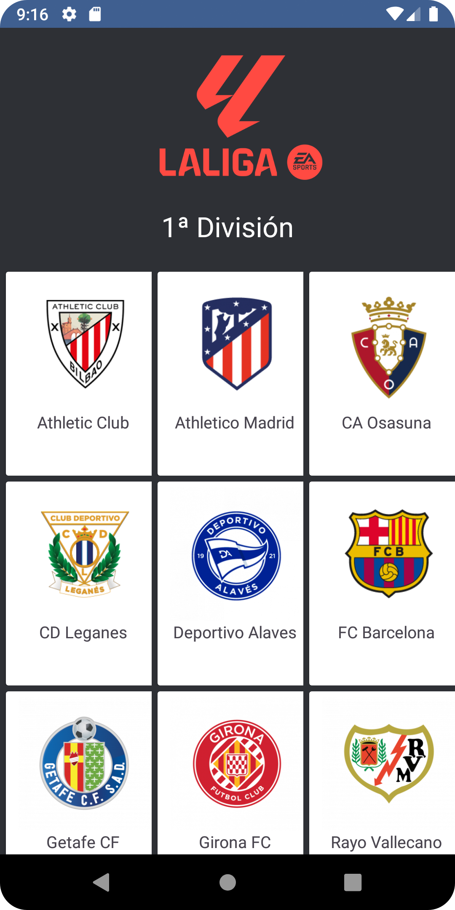
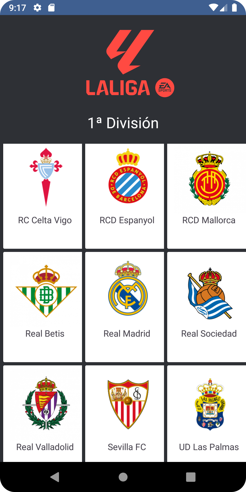
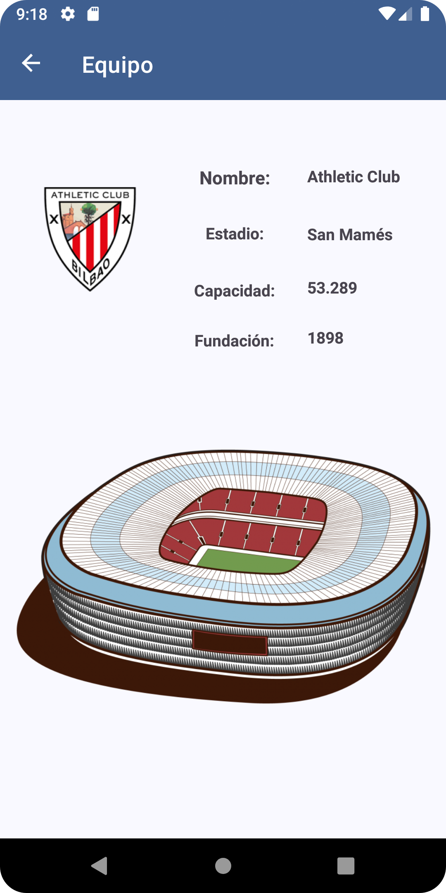

# App La liga 2024/2025

Aplicación sobre la liga española de futbol de 1º División 24/25.
Consulta la lista de equipos que la componen y algunos datos básicos sobre ellos.
Diseñada para Android en Java.

## Capturas
Inicio
 

Lista de Equipos
 

Detalle de Equipo 1
 

Detalle de Equipo 2
 

## Funcionalidad

- **Consultar** los equipos de la liga y algunos datos básicos.

## Desarrollo

- Proyecto **en construcción.**
- **Próximas actualizaciones:** 
- Ampliación de funciones.
- Almacenamiento en base de datos SQLite, MySQL o Oracle Database (añadiendo jugadores de cada equipo). 
- Cambios y mejoras en la funcionalidad. 
- Revisión de errores.

## Tecnologías

- **Lenguaje:** Java

- **IDE:** Android Studio

- **Arquitecturas:** MVVM,  patrón Singleton

- **Almacenamiento local:** Android Room

- **Clases:**  Adapter, RecyclerView, ViewModel, Entity, DAO, Repository...

## Autor

- [RobMatter](https:/https://github.com/RobMatter/)

